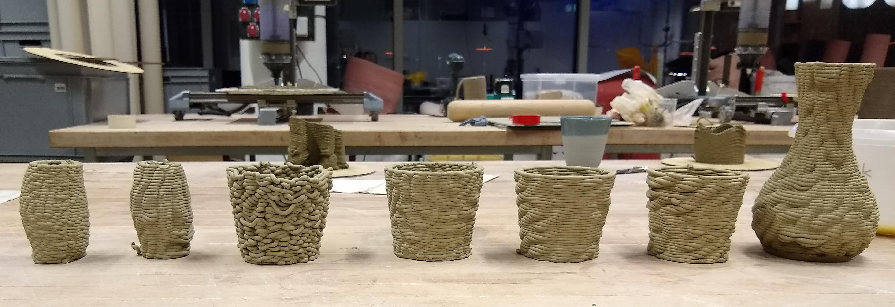

# ClayAdventures Printing Library 

This repository contains educational resources including a tutorial to conduct various **Clay  Explorations**. Most of the code is written in pure-python, visualization and operation is done throught the Rhino3D [grasshopper plugin](https://www.grasshopper3d.com). This repository was initialized by [JonasWard] for the Clay-Coral Legos project by [Marie Griesmar](https://www.mariegriesmar.com)